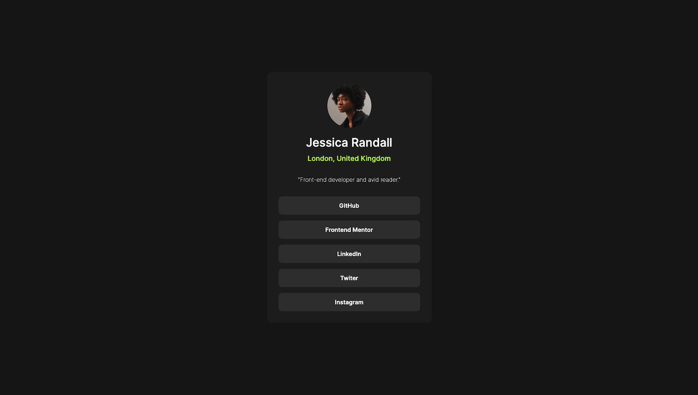

# Frontend Mentor - Social links profile solution

This is a solution to the [Social links profile challenge on Frontend Mentor](https://www.frontendmentor.io/challenges/social-links-profile-UG32l9m6dQ). Frontend Mentor challenges help you improve your coding skills by building realistic projects.

## Table of contents

- [Overview](#overview)
  - [The challenge](#the-challenge)
  - [Screenshot](#screenshot)
  - [Links](#links)
  - [Built with](#built-with)
  - [What I learned](#what-i-learned)
  - [Continued development](#continued-development)
  - [Useful resources](#useful-resources)
- [Author](#author)

## Overview

### The challenge

Build out a social link-sharing profile.

### Screenshot

### Links

- Solution URL : [Frontend Mentor](https://www.frontendmentor.io/solutions/social-link-profile-using-html-and-css-2SYK19qQzG)
- Live Site URL : [Social-link-profil](https://f9f6ee.github.io/Social-link-profile/)

## My process

### Built with

- Semantic HTML5 markup
- CSS custom properties
- Flexbox
- CSS Grid
- Mobile-first workflow

### Continued development

i'll keep working on new challenges.

**Note: Delete this note and the content within this section and replace with your own plans for continued development.**

### Useful resources

- [change-image-size-via-parent-div](https://stackoverflow.com/questions/9556514/change-image-size-via-parent-div) - This helped me for image part.

## Author

- Frontend Mentor - [@F9F6EE](https://www.frontendmentor.io/profile/F9F6EE)
